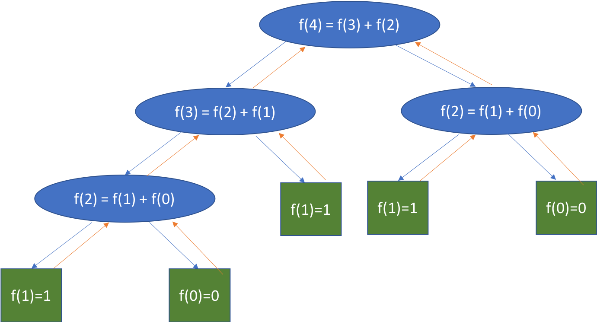
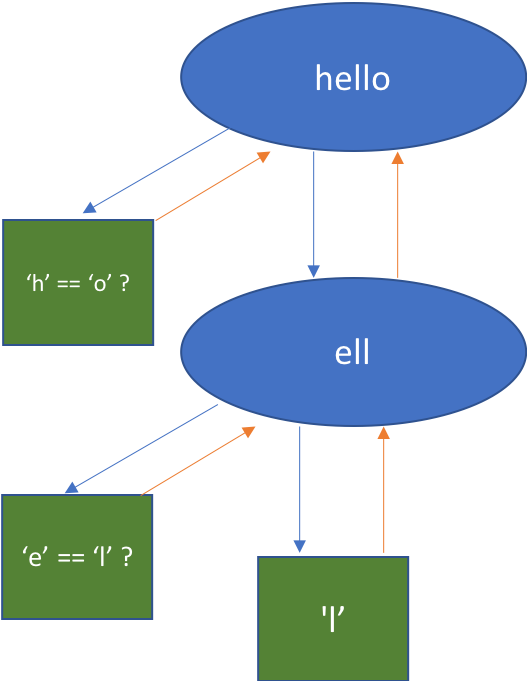

# Recursive Methods

Recursion is one of the more complicated / confusing topics in Intro Java. And while it may seem kind of unneccesary right now, it is a very useful technique to have under your built. 

In math, a function is __recursive__ if it calls itself during execution. 

For example: the fibonacci sequence 

$$0, 1, 1, 2, 3, 5, 8, 13, 21, 34, ... $$

Can be represented by the equation
$$Fib(0) = 0$$
$$Fib(1) = 1$$
$$Fib(n) = Fib(n-1) + Fib(n-2)\ \forall n \geq 2$$

In English, the nth fibbonacci number is equal to the n-1th fibonacci number plus the n-2th fibonacci number. 

In the past we've computed these functiosn iteratively


```Java
public static int fibonacci(int n) {
    int a = 0;
    int b = 1;
    for (int i = 1; i <= n; i++) {
        int tmp = b;
        b += a;
        a = tmp;
    }
    return a;
}
int n = 10;
System.out.printf("The %dth fibonacci number is %d", n, fibonacci(n));
```


```
The 10th fibonacci number is 55
```


But Java allows us to write functions that are recursive - ie methods that call themselves. This can make it a lot easier to solve some problems (like fibonacci). 

Most recursive methods are based on the __divide and conquer__ mentality. That is "this problem is too big to easily solve, but if I break it up into smaller pieces (which oare easier to solve), solve those pieces, and combine the results (in some specific way) I can solve the problem).

__All problems that can be solved iteratively (with loops) can be solved with recursion__ and oftentimes the recursive solution looks nicer than the iterative solution. __Not all recursive problems can be easily solved with loops__ - usually we want to go from iterative to recursive, not the other way around. __Recursion vs iteration is often a tradeoff between efficiency and simplicity / clarity__. 


When writing a recursive function we break the problem into two pieces 
1. The base case 
   This is the smallest instance of the problem - the point at which we know or are given the answer to the problem. For example, in the fibonacci sequence we know Fib(0) = 0 and Fib(1) = 1 - so those are our base cases. 
2. The recursive step
   This is how we want to structure our recursive calls. For example, in the fibonacci sequence we know that $Fib(n) = Fib(n-1) + Fib(n-2)$ for all $n \geq 2$. 


```Java
public static int recursiveFibonacci(int n) {
    if (n == 0) {
        return 0;
    }
    else if (n == 1) {
        return 1;
    }
    return recursiveFibonacci(n-1) + recursiveFibonacci(n-2);
}
int n = 10;
System.out.printf("The %dth fibonacci number is %d", n, recursiveFibonacci(n));
```


```    
The 10th fibonacci number is 55
```


### How does this work? 

When I call a function recursively in Java. The function is executed as expected until I reach a recursive method call. At that point, the __current method execution__ is put on hold until the recursive call completes. 


```Java
public static int recursiveFibonacci(int n) {
    System.out.printf("N = %d\n", n);
    if (n == 0) {
        System.out.println("Fib(0) = 0");
        return 0;
    }
    else if (n == 1) {
        System.out.println("Fib(1) = 1");
        return 1;
    }
    else {
        System.out.printf("Fib(%d) = Fib(%d) + Fib(%d)\n", n, n-1, n-2);
        int n_1 = recursiveFibonacci(n-1);
        System.out.printf("N = %d\n", n);
        System.out.printf("Fib(%d) = %d + Fib(%d)\n", n, n_1, n-2);
        int n_2 = recursiveFibonacci(n-2);
        System.out.printf("N = %d\n", n);
        System.out.printf("Fib(%d) = %d + %d\n", n, n_1, n_2);
        return n_1 + n_2;
    }
}

recursiveFibonacci(4);
```


```
N = 4
Fib(4) = Fib(3) + Fib(2)
N = 3
Fib(3) = Fib(2) + Fib(1)
N = 2
Fib(2) = Fib(1) + Fib(0)
N = 1
Fib(1) = 1
N = 2
Fib(2) = 1 + Fib(0)
N = 0
Fib(0) = 0
N = 2
Fib(2) = 1 + 0
N = 3
Fib(3) = 1 + Fib(1)
N = 1
Fib(1) = 1
N = 3
Fib(3) = 1 + 1
N = 4
Fib(4) = 2 + Fib(2)
N = 2
Fib(2) = Fib(1) + Fib(0)
N = 1
Fib(1) = 1
N = 2
Fib(2) = 1 + Fib(0)
N = 0
Fib(0) = 0
N = 2
Fib(2) = 1 + 0
N = 4
Fib(4) = 2 + 1


3
```


#### Recursion as a Tree



Green "leaves" are the base cases

Blue "nodes" make recursive calls

Blue "edges" recurse "downwards"

Orange "edges" passes values back up the tree

Go down the leftmost arrow first

#### Wasted Work

We can fix these issues using techniques like dynamic programming or storing pre-computed results and passing them through the recursion. You'll learn about these techniques in Data Structures or Algorithms. 


#### Exponential problem

The recursion will only end when every path down the tree has reached a base case. So the computer will have to expend effort proportional to the number base cases we eventually reach (the number of leaves in the tree). For the fibonacci function we can see that the tree is reminiscent of a binary tree - each node has at least two descendents. So there are approximately $2^{n}$ base cases in the function. 

$$Fib(4) \approx 2^4  = 16 \ effort$$

$$Fib(10) \approx 2^{10} = 1024 \ effort$$

__$$Fib(1000) \approx 2^{1000} = 1.07 \times 10^{31} \ effort$$__

We'll talk about this more in a few weeks. 

Not all recursive methods are exponential work or recompute values as we'll see below - the fibonacci sequence is just a really good example of the power and pitfalls of recursion. 

#### Recursion in the Real World

__Disclaimer:__ in this course most useful recursive problems could be easily solved iteratively. That will not always be true - especially in Data Structures and Algorithms. 

The fibonacci sequence is a cool, but not particularly useful application of recursion. Let's consider a more useful application - reversing a string. 

__Reversing a String__


```Java
public static String reverse(String s) {
    if (s.length() < 2) {
        return s;
    }
    return s.charAt(s.length() - 1) + reverse(s.substring(0, s.length() - 1));
}

String toReverse = "Hello World";
System.out.printf("\"%s\" reversed is \"%s\"", toReverse, reverse(toReverse));
```


```
"Hello World" reversed is "dlroW olleH"
```


Observe that this tree is linear and doesn't require any recalculation

__Checking if a String is a Palindrome__


```Java
public static boolean recursiveIsPalindrome(String s) {
    if (s.length() < 2) {
        return true;
    }
    return s.charAt(0) == s.charAt(s.length() - 1) 
           && recursiveIsPalindrome(s.substring(1, s.length() - 1));
}

String s1 = "racecar";
String s2 = "hello";
System.out.printf("\"%s\" is a palindromw? " + recursiveIsPalindrome(s1) + "\n", s1);
System.out.printf("\"%s\" is a palindromw? " + recursiveIsPalindrome(s2) + "\n", s2);
```

    "racecar" is a palindromw? true
    "hello" is a palindromw? false





Observe that this tree is linear and doesn't require any recalculation. However, this is also a bit wasteful since we already know that "hello" is not a palindrome after the first check. We can fix this by being more reative base cases. 


```Java
public static boolean recursiveIsPalindromeTwo(String s) {
    if (s.length() < 2) {
        return true;
    }
    else if (s.charAt(0) != s.charAt(s.length() - 1)) {
        return false;
    }
    return recursiveIsPalindromeTwo(s.substring(1, s.length() - 1));
}

String s1 = "racecar";
String s2 = "hello";
System.out.printf("\"%s\" is a palindromw? " + recursiveIsPalindromeTwo(s1) + "\n", s1);
System.out.printf("\"%s\" is a palindromw? " + recursiveIsPalindromeTwo(s2) + "\n", s2);
```

## Guidelines for Recursion

Keep the divide and conquer philosophy in mind.
1. Start with the base case. What is the easiest version of this problem? When do i definitely know I can solve this problem? 
2. What is a good way to divide this problem up?
3. How can I recombine sub-solutions to get the actual solution?

## Common Errors in Recursion

### StackOverflowExceptions

Remember when you learned about loops we said "your while loops need to terminate at some point otherwise your code will run forever"? Recursion works the same way. If you don't have a base case (or if your function doesn't reach the base case after a reasonable amount of iterations, your computer will run out of "stack memory" (don't worry about what that means) and will throw a __StackOverflowException__. 


```Java
public static int badRecursiveFibonacci(int n) {
    return badRecursiveFibonacci(n-1) + badRecursiveFibonacci(n-2);
}

int n = 10;
badRecursiveFibonacci(n);
```

```
---------------------------------------------------------------------------
java.lang.StackOverflowError: 
    at .badRecursiveFibonacci(#29:2)
    at .badRecursiveFibonacci(#29:2)
    at .badRecursiveFibonacci(#29:2)
    at .badRecursiveFibonacci(#29:2)
    at .badRecursiveFibonacci(#29:2)
```

Obviously the code above is bad. It doesn't make sense based on our understanding of the fibonacci function. But sometims you may include a base case that is unreachable or not easily reachable. When you're writing recursive functions __always make sure your recursive methods have a reachable base case__.


```Java
/* Calculates the sume of the range 0, n */
public static int sumOfRange(int n) {
    if (n == 0) {
        return 0;
    }
    return n + sumOfRange(n - 1);
}
```


```Java
sumOfRange(-10);
```


```
---------------------------------------------------------------------------
java.lang.StackOverflowError: 
    at .sumOfRange(#33:6)
    at .sumOfRange(#33:6)
    at .sumOfRange(#33:6)
    at .sumOfRange(#33:6)
    at .sumOfRange(#33:6)
```

The proper way to do this would be to set the base case to catch the < 0 case
and write documentation explaining what invalid input will return


```Java
/**
 * Calculates the sume of the range 0, n where n is a posative integer
 * @param n a posative integer
 * @return the sum of all integers between 0 and n inclusive if n is posative.
 * else 0. 
 */
public static int sumOfRange(int n) {
    if (n <= 0) {
        return 0;
    }
    return n + sumOfRange(n - 1);
}
```


```Java
sumOfRange(10);
sumOfRange(-10);
```

```
55
0
```
### Excessive Computation

As we said above, recursive methods can compute the same results a lot of times if you don't explicitly take steps to prevent that. So sometimes even if you have a base case, if you give a recursive problem a really large input, it will either take a long time to run or throw a StackOverflowException.

```Java
public static int badRecursiveFibonacciTwo(int n) {
    if (n == 0) {
        return 0;
    }
    else if (n == 1) {
        return 1;
    }
    return badRecursiveFibonacciTwo(n-1) + badRecursiveFibonacciTwo(n-2);
}
badRecursiveFibonacciTwo(1000);
```

# Solutions to Practice Problems

__From decimal to binary__

Given an integer $n$ in base 10, convert $n$ to binary (base 2). 
https://en.wikipedia.org/wiki/Binary_number


```Java
public static String toBinary(int n) {
    if (n < 0) { // error case
        return "";
    }
    else if (n < 2) { // base case
        return "" + n;
    }
    return toBinary(n / 2) + n % 2;
}

toBinary(10);
```

```
"1010"
```


__Convert to arbitrary base__

So far we've only converted to bases lower than 10. But if we're converting to bases > 10 we need more digits to represent digit values > 10. We use the convention that 10 -> 'A', 11 -> 'B', 12 -> 'C'...


```Java
/**
 * Helper method that converts a single decimal digit to base newBase. 
 * @param val the integer digit in base 10. 0 <= val < newBase.
 * @param newBase the base we are converting to. newBase > 2.
 * @return the String newBase representation of val or "-1" if the 
 * input value is invalid.
 */
public static String getDigit(int val, int newBase) {
    if (val < 0 || val > newBase || newBase < 2) {
        return "-1";
    }
    if (val < 10) {
        return "" + val;
    }
    return "" + (char)('A' + (val - 10));
}

public static String toBase(int n, int newBase) {
    if (n <= 0) {
        return "";
    }
    return toBase(n / newBase, newBase) + getDigit(n % newBase, newBase);
}

toBase(15, 16);
toBase(145, 16);
```


```
"F"
"91"
```


__Sum of digits__

Given an posative integer, return the sum of the digits of the integer.


```Java
public static int sumDigits(int n) {
    if (n <= 0) {
        return 0;
    }
    return n % 10 + sumDigits(n / 10);
}

sumDigits(44);
```


```
8
```


__Stair climbng__

You are standing at the base of an n-step staircase. At each step you can either move forward by one step or two steps. How many unique ways can you climb the staircase?


```Java
public static int numSteps(int n) {
    if (n <= 2) {
        return n;
    }
    return numSteps(n - 1) + numSteps(n - 2);
}

numSteps(5);
```


```
8
```


__Stair climbing pt 2__

Given the same situation as above, how many unique ways can you climb the staircase if you can move forward by one, two, or three steps? 


```Java
public static int numSteps(int n) {
    if (n <= 2) {
        return n;
    }
    else if (n == 3) {
        return 4;
    }
    return numSteps(n - 1) + numSteps(n - 2) + numSteps(n-3);
}

numSteps(5);
```


```
13
```
