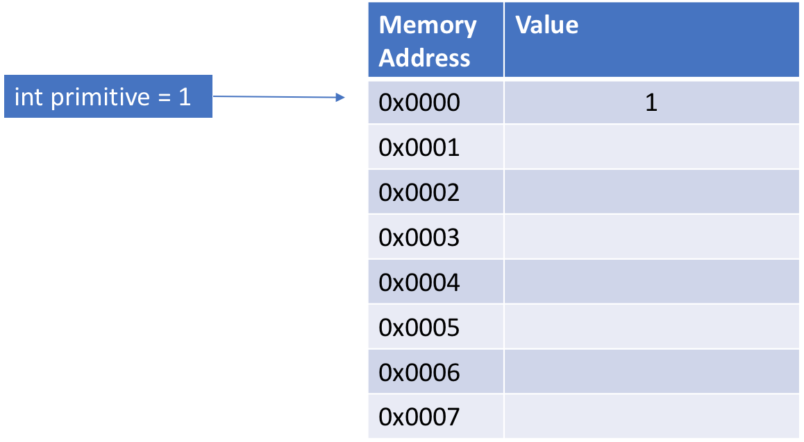

So far we've worked with data types that have been defined for us. However a lot of the time we want to be able to define our own data types - with their own associated variables and methods. This is the basic principle behind __Object Oriented Programming__. Object oriented programming is a programming paradigm centered around user defined data types (aka objects). An object oriented programming language (like Java) allows users to define their own data types and use them in programs. From here on out I'll say object instead of data type. 

We define our own objects by writing an __instantiable class__. An instantiable class is essentially a blueprint for an object - it defines what an object contains, how to create an object, and the methods you can call on the object. 
A basic instantiable class can be broken down into three sections
1. The member variables - The member variables define what data the object stores. 
2. The constructor(s) - The constructors define how we create a new instance of the object.
3. The methods - These are methods we can call on the object.

__The Problem__

We're going to be using this problem for most of our discussion of OOP. The NBA playoffs are coming up and we want to write a program to keep track of the performance of our favorite basketball teams as they advance through the postseason. We could write some really complicated code to keep track of each team and link their win / loss percentages together, but instead we're going to use object oriented programming.


```Java
public class Team {
    
    public String name;
    public int gamesWon;
    public int gamesLost;
    public double winPercentage;
    
    public Team(String name) {
        this.name = name;
        this.gamesWon = 0;
        this.gamesLost = 0;
        this.winPercentage = 0;
    }
    
    public void updateWinPercentage() {
        if (this.gamesWon + this.gamesLost == 0) {
            this.winPercentage = 0;
        }
        this.winPercentage = 100 * (double)this.gamesWon 
               / (this.gamesWon + this.gamesLost);
    }
    
    public String toString() {
        return String.format("%s: %d won %d lost, %.2f%%",
               this.name, this.gamesWon, this.gamesLost, 
               this.winPercentage);
    }
}
```

This is a very basic class. Note the three parts
1. The member variables are name, gamesWon, and gamesLost. These values are accessible anywhere within the entire class. 
2. The constructor is a method with the same name as the class (in this case Team). It is used to set up the object. It is possible to have more than one constructor. 
3. In this case we only have one method. This method uses the stored gamesWon and gamesLost to get the team's win percentage. 

Also note that the `this` keyword refers to the current instance of the class. When I call `this.gamesLost` inside a class definition I am referring to the `gamesLost` variable inside a specific instance of `Team`. 

You must save an instantiable class in a file with the same name as the class. So the Team class would be in a file called Team.java. 
The easiest way to access the Team class from another program is to save Student.java in the same folder (directory) as the driver (program with the main method). 

Now we can create variables that are "instances" of type Team whose behavior is defined by the blueprint above. 


```Java
Team kings = new Team("Sacramento Kings");
Team lakers = new Team("LA Lakers");
```

Now that we've created some Teams we can access and modify their stored variables and call their methods. 


```Java
System.out.println(kings.toString());
System.out.println(lakers.toString());
// if the kings beat the lakers
kings.gamesWon++;
lakers.gamesLost++;
kings.updateWinPercentage();
lakers.updateWinPercentage();
System.out.println(kings.toString());
System.out.println(lakers.toString());
```

There is a major problem with this construction. Anyone can change any of the variables at any time. This can be advantageous sometimes, but usually it leads to synchronization problems between our variables.


```Java
kings.gamesLost += 10;
System.out.println(kings.toString());

lakers.gamesWon -= 10;
lakers.updateWinPercentage();
System.out.println(lakers.toString());
```

To fix these inconsistencies, we define our variables with the private keyword instead of public. If a member variable or method is private it cannot be seen or accessed outside of the class - the methods inside the class can access private variables and methods, but nothing outside can access a private variable or method. We then write methods to "get" and "set" the member variables - we call these getter and setter methods. 
For our Team class:


```Java
public class Team {
    
    private String name;
    private int gamesWon;
    private int gamesLost;
    private double winPercentage;
    
    public Team(String name) {
        this.name = name;
        this.gamesWon = 0;
        this.gamesLost = 0;
        this.winPercentage = 0;
    }
    
    public String getName() { return this.name; }
    public int getGamesWon() { return this.gamesWon; }
    public int getGamesLost() { return this.gamesLost; }
    public double getWinPercentage() { return this.winPercentage; }
    
    public void wonGame() { 
        this.gamesWon++; 
        this.updateWinPercentage();
    }
    
    public void lostGame() { 
        this.gamesLost++; 
        this.updateWinPercentage();
    }
    
    private void updateWinPercentage() {
        if (this.gamesWon + this.gamesLost == 0) {
            this.winPercentage = 0;
        }
        this.winPercentage = 100 * (double)this.gamesWon 
               / (this.gamesWon + this.gamesLost);
    }
    
    public String toString() {
        return String.format("%s: %d won %d lost, %.2f%%",
               this.name, this.gamesWon, this.gamesLost, 
               this.winPercentage);
    }
}
```

Like member variables, class methods can be public or private. Public methods can be called from an external class and private methods can only be called from within the class. We use private methods to execute "helper" functions that we don't want the user to explicitly do. For example, we set the `updateWinPercentage` method to private because we want that to be done internally, without external user input. 


```Java
Team kings = new Team("Sacramento Kings");
Team lakers = new Team("LA Lakers");

System.out.println(kings.toString());
System.out.println(lakers.toString());
// if the kings beat the lakers
kings.wonGame();
lakers.lostGame();
System.out.println(kings.toString());
System.out.println(lakers.toString());

for (int i = 0; i < 10; i++) {
    kings.lostGame();
}
System.out.println(kings.toString());
```

Setting variables and methods to private forces users and other programmers to interact with your class in ways that you have defined. This makes it a lot easier to write error-free code. 

For example, in the above example I can no longer just set a team to lose or win a bunch of games. They can only lose or win one game at a time. 

When programming (in the real world) you should operate under the assumption that the user will try to break your programs - you should write and test your code accordingly. 

### Common Methods

Most classes you write will have some methods in common
1. toString() - this method returns a string representation of the object
2. equals(Object o) - this method compares the object with another object
3. compareTwo(Object o) - this method checks if two objects are equal to each other. 


```Java
public class Team {
    
    private String name;
    private int gamesWon;
    private int gamesLost;
    private double winPercentage;
    
    public Team(String name) {
        this.name = name;
        this.gamesWon = 0;
        this.gamesLost = 0;
        this.winPercentage = 0;
    }
    
    public String getName() { return this.name; }
    public int getGamesWon() { return this.gamesWon; }
    public int getGamesLost() { return this.gamesLost; }
    public double getWinPercentage() { return this.winPercentage; }
    
    public void wonGame() { 
        this.gamesWon++; 
        this.updateWinPercentage();
    }
    
    public void lostGame() { 
        this.gamesLost++; 
        this.updateWinPercentage();
    }
    
    private void updateWinPercentage() {
        if (this.gamesWon + this.gamesLost == 0) {
            this.winPercentage = 0;
        }
        this.winPercentage = 100 * (double)this.gamesWon 
               / (this.gamesWon + this.gamesLost);
    }
    
    public boolean equals(Object o) {
        if (o instanceof Team) {
            Team other = (Team) o;
            return this.gamesWon == other.getGamesWon() 
                   && this.gamesLost == other.getGamesLost()
                   && this.name.equals(other.getName());
        }
        return false;
    }
    
    public int compareTo(Object o) {
        if (o instanceof Team) {
            Team other = (Team) o;
            return (int)(this.winPercentage - other.getWinPercentage());
        }
        return -1;
    }
    
    public String toString() {
        return String.format("%s: %d won %d lost, %.2f%%",
               this.name, this.gamesWon, this.gamesLost, 
               this.winPercentage);
    }
}
```


```Java
Team kings = new Team("Sacramento Kings");
Team lakers = new Team("LA Lakers");
System.out.println("Comparing kings and lakers " + kings.compareTo(lakers));
kings.wonGame();
lakers.lostGame();
System.out.println("Comparing kings and lakers " + kings.compareTo(lakers));
Team otherKings = new Team("Sacramento Kings");
System.out.println("Are two kings equal? " + kings.equals(otherKings));
otherKings.wonGame();
System.out.println("Are two kings equal? " + kings.equals(otherKings));
```

The keyword `instanceof` checks to see if some object is an instance of the given type. So `o instanceof Team` evaluates to true if `o` can be viewed as a `Team` and false if not. 

### Defining Static

In Java, a static member is a member of a class that isn’t associated with an instance of a class. Instead, the member belongs to the class itself. As a result, you can access the static member without first creating a class instance.

Consider the `Math` class. You can use `Math.abs` and `Math.pow` without doing `Math m = new Math();`. `abs` and `pow` are thus `static` members of the `Math` class because they don't depend on a specific instantiation of `Math`. 

Your main method is also always `static` because it is irrespective of any potential instantiation of the class. 


```Java
public class Team {
    
    private String name;
    private int gamesWon;
    private int gamesLost;
    private double winPercentage;
    private static final int numPlayers = 5;
    
    public Team(String name) {
        this.name = name;
        this.gamesWon = 0;
        this.gamesLost = 0;
        this.winPercentage = 0;
    }
    
    public static void playGame(Team won, Team lost) {
        won.wonGame();
        lost.lostGame();
    }
    
    public String getName() { return this.name; }
    public int getGamesWon() { return this.gamesWon; }
    public int getVamesLost() { return this.gamesLost; }
    
    public void wonGame() { 
        this.gamesWon++; 
        this.updateWinPercentage();
    }
    
    public void lostGame() { 
        this.gamesLost++; 
        this.updateWinPercentage();
    }
    
    private void updateWinPercentage() {
        if (this.gamesWon == 0 && this.gamesLost == 0) {
            this.winPercentage = 0;
        }
        this.winPercentage = 100 * (double)this.gamesWon 
               / (this.gamesWon + this.gamesLost);
    }
    
    public boolean equals(Object o) {
        if (o instanceof Team) {
            Team other = (Team) o;
            return this.gamesWon == other.getGamesWon() 
                   && this.gamesLost == other.getGamesLost()
                   && this.name.equals(other.getName());
        }
        return false;
    }
    
    public int compareTo(Object o) {
        if (o instanceof Team) {
            Team other = (Team) o;
            return (int)(this.winPercentage - other.getWinPercentage());
        }
        return -1;
    }
    
    public String toString() {
        return String.format("%s: %d won %d lost, %.2f%%",
               this.name, this.gamesWon, this.gamesLost, 
               this.winPercentage);
    }
}
```


```Java
Team kings = new Team("Sacramento Kings");
Team lakers = new Team("LA Lakers");

System.out.println(kings.toString());
System.out.println(lakers.toString());
// if the kings beat the lakers
Team.playGame(kings, lakers);
System.out.println(kings.toString());
System.out.println(lakers.toString());
```

### Pass by Reference Value

One of the major differences between primitive types and Objects is how they are represented in memory. We can visualize the computer memory as a array where the data at the $i$th index corresponds to memory address $i$:


When we define a primitive, for example `int primitive = 1;`, the variable `primitive` points to (aka references) some memory address $i$ and the data at memory address $i$ is the value of `primitive` (ie 1).



However, when we define an Object, for example `SomeClass nonPrimitive = new SomeClass();`, the variable `nonPrimitive` references some memory address $j$ but the data at memory address $j$ is another memory address $k$. The data at memory address $k$ is the data corresponding to `nonPrimitive`.


This distinction comes into play when we pass variables into methods. Java "passes by reference value". That means that when if I have a variable `x` that references some memory address $A$, when I pass `x` into a method the computer will copy the data at $A$ and save it at a new memory address $B$.

If `x` is primitive, the data at $A$ is the value of `x`. So when we pass `x` into a method, the computer copies the value of `x` to $B$ and uses that memory address in when executing the method - effectively we copy `x` into a new variable and use that new variable in the method. The effect of this is that __if I pass a primitive variable into a method, changing the variable inside the method will not effect the variable outside of the method__. 

However, if `x` is not primitive, the data at $A$ is a reference to the data associated with `x`. So when we pass `x` into a method, the reference to the data is copied to $B$ and that memory address is used when executing the method. This effectively means that __if we call any methods on `x` that change `x` inside the method, those changes will effect the variable outside of the method__. However __if, inside the method, we set `x` to a new value, that changes the value of the reference at $B$ rather than the data referenced by $B$ so the value of `x` will not change outside the method__. 


```Java
public class SimpleClass {
    
    private int data;
    
    public SimpleClass(int x) {
        this.data = x;
    }
    
    public int getData() { return this.data; }
    
    public void makeSimpleClass(SimpleClass y) {
        this.data = y.getData();
    }
    
    public String toString() {
        return "SimpleClass: " + this.data;
    }
}
```


```Java
public static void attemptSwap(int x, int y) {
    int temp = x;
    x = y;
    y = temp;
}

int varOne = 10;
int varTwo = 20;
System.out.printf("varOne=%d, varTwo=%d\n", varOne, varTwo);
attemptSwap(varOne, varTwo);
System.out.printf("varOne=%d, varTwo=%d\n", varOne, varTwo);
```

    varOne=10, varTwo=20
    varOne=10, varTwo=20


```Java
public static void attemptSwap(SimpleClass x, SimpleClass y) {
    SimpleClass temp = new SimpleClass(x.getData());
    x.makeSimpleClass(y);
    y.makeSimpleClass(temp);
}

SimpleClass cOne = new SimpleClass(10);
SimpleClass cTwo = new SimpleClass(20);
System.out.printf("cOne=%s, cTwo=%s\n", cOne.toString(), cTwo.toString());
attemptSwap(cOne, cTwo);
System.out.printf("cOne=%s, cTwo=%s\n", cOne.toString(), cTwo.toString());
```

    cOne=SimpleClass: 10, cTwo=SimpleClass: 20
    cOne=SimpleClass: 20, cTwo=SimpleClass: 10


```Java
public static void attemptSwap(SimpleClass x, SimpleClass y) {
    SimpleClass temp = x;
    x = y;
    y = temp;
}

SimpleClass cOne = new SimpleClass(10);
SimpleClass cTwo = new SimpleClass(20);
System.out.printf("cOne=%s, cTwo=%s\n", cOne.toString(), cTwo.toString());
attemptSwap(cOne, cTwo);
System.out.printf("cOne=%s, cTwo=%s\n", cOne.toString(), cTwo.toString());
```

    cOne=SimpleClass: 10, cTwo=SimpleClass: 20
    cOne=SimpleClass: 10, cTwo=SimpleClass: 20


# Solutions
1. 
    a. Missing comments - all class and methods
    b. output
    1
    3
    3
    10
    
2. 
    String courseId (ex: "EN.601.107")
    String courseName (ex: "Introductory Programming in Javaa")
    float credits (ex: 3.0)
    String area (ex: "E")
    String professor (ex: "Sara Miner More")

3. 
    a. private non-static
    b. private non-static
    c. private static
    d. public non-static
    e. public static
    f. private non-static
    g. public non-static

4. 

```Java
/** Class to represent rational numbers (fractions)
*  with whole number numerators and denominators.
*/
public class Rational {

    private int numer;
    private int denom;

    public Rational(int n, int d) {
        this.numer = n;
        this.setDenom(d);
    }

    public int setDenom(int den) {
        if (den == 0)
             this.denom = 1;
        else {
             this.denom = den;
             if (den < 0) {
                    this.denom = -this.denom;
                    this.numer = -this.numer;
             }
        }
        return this.denom;
    }

    public void add(Rational other) {
        this.numer = other.numer * this.denom + this.numer * other.denom;
        this.setDenom(this.denom * other.denom);
    }

    /** Create a string representation of the object
    *  in the form "a/b" or "-a/b" where a is the
    *  numerator value and b is the denominator. (There should
    *  never be a negative sign in the denominator.)
    *  @return the string version
    */
    public String toString() {
        String ret = "";
        if (this.isNegative()) {
            ret += "-";
        return String.format("%s%d/%d", ret, Math.abs(a), Math.abs(b))
    }

    /** Check whether the rational is negative or not.
    *  @return true if negative, false otherwise.
    */
    public boolean isNegative() {
    	return (a < 0 || b < 0) && !(a < 0 && b < 0);
    	// you can also use the logical xor operator 
    	// return (a < 0 ^ b < 0)
    	// X xor Y returns true if X is true or Y is true but not both
    }

    /** Return the real number equivalent of the rational number.
    *  @return the actual value
    */
    public double value() {
    	return (double)a / b;
    }

    /** Add a whole number to the rational number.
    *  @param number the integer to add
    */ 
    public void add(int x) {
    	Rational r = new Rational(x, 1)
    	this.add(r);
    }
}                          
```

5. 
Run this code:
```Java
public static void main(String[] args) {

	Rational r = new Rational(10, 5);
	Rational s = new Rational(-7, 0);
	Rational f = new Rational(-10, -20);
	
	System.out.println(r + " is r, " + s + " is s, " + f + " is f");
	int negs = 0;
	if (s.isNegative()) negs++;
	if (r.isNegative()) negs++;
	if (f.isNegative()) negs++;
	System.out.println(negs + " negative fraction(s)");
	
	s.setDenom(10);
	System.out.println(s.value());
	s.add(100);
	System.out.println("new s is " + s.toString());
	
	double d = f.value() + r.value();
	System.out.println("f+r is " + d);
	f.add(r);
	System.out.println("f+r is " + f);
	System.out.println("r is still " + r);
	
	r = new Rational(2, 3);
	f = r;
	f.setDenom(5);
	System.out.println("r is " + r + " and f is " + f);
}
```
